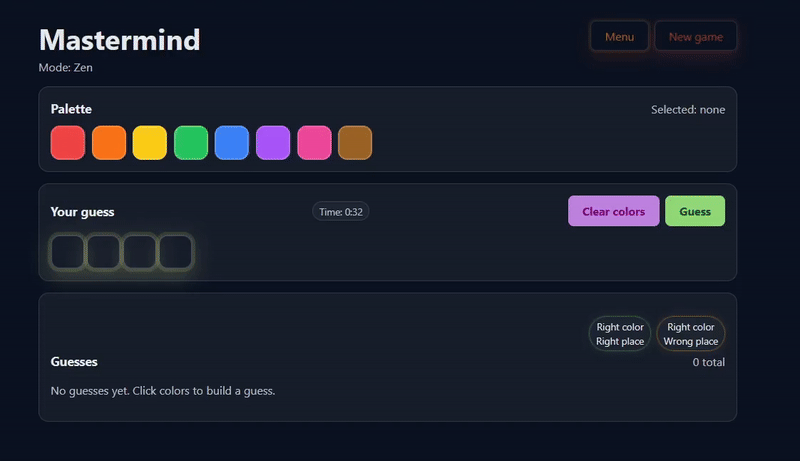

# Natty Mastermind (Vite + React + TypeScript)

A client-side single page application for a Mastermind-style game using **colors** — featuring a **Daily Challenge** and fully customizable games.


## Key files (start here)

These are the most important files to understand the project quickly:

- App entry point (mounts React): [src/main.tsx](src/main.tsx)
- App state + game flow (menu → game, Daily Challenge, limits, submit): [src/App.tsx](src/App.tsx)
- Core game logic (secret generation + scoring): [src/mastermind.ts](src/mastermind.ts)
- Settings + modes (defaults, clamping, clock formatting): [src/game/config.ts](src/game/config.ts)
- Main menu (difficulty + mode selection + steppers): [src/components/MainMenu.tsx](src/components/MainMenu.tsx)
- Palette UI: [src/components/PalettePanel.tsx](src/components/PalettePanel.tsx)
- Guess row UI: [src/components/GuessPanel.tsx](src/components/GuessPanel.tsx)

## Tech stack

[](https://nodejs.org/en)
[](https://www.typescriptlang.org)
[](https://react.dev)
[](https://vitejs.dev)
[](https://eslint.org)

## Features

- Daily Challenge (one shared puzzle per day)
- Configurable difficulty (code length, palette size, duplicates)
- Multiple modes:
  - **Zen** (no limits)
  - **Time** (solve before the timer runs out)
  - **Limited guesses** (solve before running out of guesses)
- Mobile-friendly steppers (supports long-press / press-and-hold)
- Fast controls:
  - Click-to-place and right-click-to-clear pegs
  - Drag & drop from the palette to the guess row (desktop + mobile)
  - Drag from peg → peg to copy colors within the current guess (non-empty pegs only)
- Guess history + scoring badges (click a previous guess to refill the current guess row)
- Secret reveal when the game ends, and “Copy results” for Daily Challenge
- Social link previews (Open Graph / Twitter Cards)

## Overall system design

At a high level, the app is a single React tree that keeps the entire game state in memory. The UI updates are driven by React state, and the “game logic” (secret generation + scoring) is pure TypeScript.

### Data flow

1. **Start game** → generate a new secret based on the current settings.
2. **Player builds a guess** by selecting a palette color and placing it into slots.
3. **Submit guess** → score the guess against the secret.
4. **Render feedback** → show counts for:
   - right color + right place
   - right color + wrong place
5. Repeat until solved, or a mode limit ends the game.

### Code map (where things live)

- `src/App.tsx`: top-level state machine (menu vs game), state storage, timing/limits, submit handler.
- `src/mastermind.ts`:
  - `generateSecret(...)` uses the Web Crypto API for randomness.
  - `generateSecretSeeded(...)` generates deterministic secrets (used for the Daily Challenge).
  - `scoreGuess(secret, guess)` calculates the two feedback counts.
- `src/game/config.ts`: settings types, defaults, clamping/normalization, clock formatting.
- `src/game/palette.ts`: color palette definitions.
- `src/components/*`: UI components (menu, palette, guess row, history, header, confetti overlay).

### Daily Challenge

The Daily Challenge uses a deterministic seed based on the current **UTC date** (so everyone gets the same puzzle that day). The secret is generated with `generateSecretSeeded(...)`.

Daily Challenge is intentionally a fixed ruleset:

- Mode: **Zen**
- Code length: **8**
- Palette size: **14**
- Duplicates: **allowed**
- “Give up” is disabled
- Win screen includes a **Copy results** button

## How the game works

### Rules

- The game generates a hidden **secret code** (a sequence of colors).
- You choose the difficulty on the main menu:
  - **Colors in secret** = code length (min 3; menu UI caps at 6, Daily Challenge uses 8)
  - **Palette size** = number of available colors (min 6, max 14)
  - **Allow duplicates** = whether the secret may repeat colors
- You can guess duplicates even if the secret is unique.

### Making a guess

- Click a color in the palette to select it.
- Click a slot in the guess row to place the selected color.
- Right-click a slot to clear it.
- Drag & drop a color onto a slot (desktop), or touch-drag on mobile.
- Drag from one filled peg to another to copy that color (acts like dragging from the palette; empty pegs can’t be dragged).
- Click a row in **Guesses** to refill your current guess with that previous guess.
- Press **Guess** (or **Enter**) to submit.



### Game end states

- **Solved**: you matched the full secret.
- **Time mode**: the game ends when time hits 0.
- **Limited guesses**: the game ends when you run out of guesses.
- **Give up**: available for non-daily games (reveals the secret).

### Feedback (scoring)

Each submitted guess returns two numbers:

- **Right color, right place**: how many positions match exactly.
- **Right color, wrong place**: how many additional pegs match in color after accounting for exact matches (duplicates are handled correctly).

You solve the puzzle when **right color, right place = code length**.

### Modes

- **Zen**: no limits; play until solved.
- **Time**: solve before time runs out.
- **Limited guesses**: solve before you run out of guesses.


## Run locally

Requirements: Node.js 18+ (recommended 20+).

```bash
npm install
npm run dev
```

## Tests

```bash
npm run test
```

```bash
npm run test:run
```

## Lint

```bash
npm run lint
```

## Build

```bash
npm run build
npm run preview
```

## Mobile notes

- The app includes safeguards to reduce accidental refresh/reset on mobile browsers (e.g. pull-to-refresh while playing).
- Daily Challenge UI uses smaller tile sizes to fit 8 pegs + 14 colors on small screens.

## Deployment

- GitHub Pages deploy workflow: .github/workflows/deploy-pages.yml
- Vite base is configured to be portable across root domains and subpaths (`base: './'` in production).

## Social previews (WhatsApp/Facebook/etc)

The project includes Open Graph / Twitter Card metadata in index.html, and a share image at public/og-image.svg.

## Sources / references

These are the main references used while building this project:

- Mastermind rules (classic board game rules; implemented as “exact matches” and “color-only matches”)
- React documentation: https://react.dev
- Vite documentation: https://vitejs.dev
- TypeScript documentation: https://www.typescriptlang.org
- Web Crypto API (used for randomness): https://developer.mozilla.org/docs/Web/API/Web_Crypto_API

Assets:

- Custom favicon/logo is an SVG in `public/favicon.svg`.

Analytics:

- Google Analytics tag is included in index.html.
